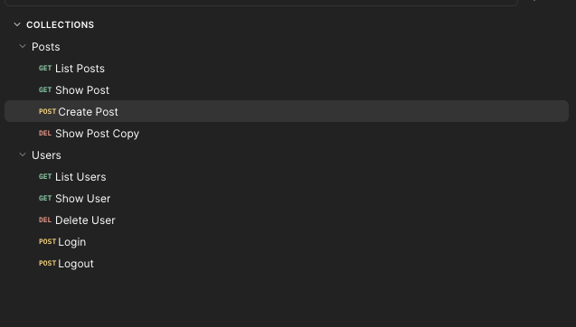
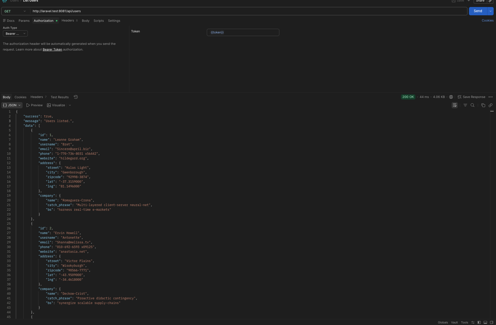
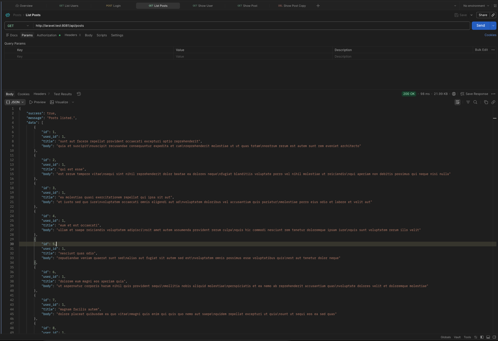

## SLMP APP
```
A Laravel-based RESTful API system that user, post data from https://jsonplaceholder.typicode.com.
```

## Technologies
- PHP > 8.3
- Laravel >= 13
- MySQL
- Composer
- Node

## 📦 Packages Used
```
- laravel/sail
- laravel/sanctum
```

## **🚀 Installation (Option 1)**

### Pre requisites: Herd

1. Clone the repository: **`git clone git@github.com:anthnyrys-dev/slmp-app.git`**
2. Navigate to the project directory: **`cd slmp-app`**
3. Copy env variables: **`cp .env.example .env`**
4. Install dependencies: **`composer install`**
5. Run npm: **`npm install`**
6. Run migrations **`./vendor/bin/sail artisan migrate`**
7. Run seeders **`/vendor/bin/sail artisan db:seed`**

## **🚀 Installation (Option 2)**
```
Pre requisites:
- Docker / Docker compose

php artisan sail:install
- ./vendor/bin/sail composer install
- ./vendor/bin/sail composer dump-autoload
- ./vendor/bin/sail up -d
- ./vendor/bin/sail artisan key:generate
- ./vendor/bin/sail artisan migrate
```

## 🔐 **Authentication**
```
User
email: <any user available after running UserSeeder>
password: P@ssword1234
```

## 📡 **API Endpoints**

### Authentication

```http
POST /api/login
Content-Type: application/json

{
  "email": "john@example.com",
  "password": "Password123",
  "device_name": "web"
}

Response: { "token": "..." }
```

```http
POST /api/logout
Authorization: Bearer {token}

Response: 204 No Content
```


```http
POST /api/users
Content-Type: application/json
```

```http
POST /api/posts
Content-Type: application/json
```

## 📮 **Postman Collections**
```
/postman-collections
- Posts.postman_collection.json
- Users.postman_collection.json
```

## **Seeder**
```bash
./vendor/bin/sail artisan db:seed --class=UserSeeder
./vendor/bin/sail artisan db:seed --class=PostSeeder

```

## **Screenshots**



